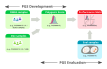

# PGS Construction Process and Stages

## Overview of polygenic risk score construction

PGS is calculated as a weighted sum of several risk variants from a
genome-wide association study in one or more samples with multiple
p-value thresholds. The effect sizes are typically estimated as
$`\beta`$ (beta coefficients) or as odds ratios. After the PGS is
calculated in one sample, the distribution of individual PGS is assessed
in another in an independent sample set.

, \[CC BY
4.0\](https://creativecommons.org/licenses/by/4.0/).](../reference/figures/pgs-construction-process.png)

Adapted from [Konuma & Okada
(2021)](https://doi.org/10.1186/s41232-021-00172-9), [CC BY
4.0](https://creativecommons.org/licenses/by/4.0/).

## PGS development and evaluation stages



In the PGS Catalog, cohorts and samples are annotated according to their
utilisation context, i.e. stage, in the PGS construction process. In
quincunx, the stage is indicated by the `stage` variable that can have
one of these values:

- `gwas`: to annotate samples used to derive variant associations (GWAS)
- `dev`: to annotate samples used in the development or training of PGSs
- `gwas/dev`: as a catch-all term to annotate samples used either in
  `gwas` or `dev` stages
- `eval`: to annotate samples used in the PGS evaluation stage

You will encounter the stage annotation in tables of objects returned by
quincunx’s retrieval functions. Here are a few examples:

### In a `scores` object

``` r

get_scores('PGS000327')@samples
#> # A tibble: 2 × 15
#>   pgs_id    sample_id stage sample_size sample_cases sample_controls
#>   <chr>         <int> <chr>       <int>        <int>           <int>
#> 1 PGS000327         1 gwas        46350           NA              NA
#> 2 PGS000327         2 dev         28592        10461           18131
#> # ℹ 9 more variables: sample_percent_male <dbl>, phenotype_description <chr>,
#> #   ancestry_category <chr>, ancestry <chr>, country <chr>,
#> #   ancestry_additional_description <chr>, study_id <chr>, pubmed_id <int>,
#> #   cohorts_additional_description <chr>
```

### In a `sample_sets` object

``` r

get_sample_sets(pgs_id = 'PGS000327')@samples
#> # A tibble: 1 × 15
#>   pss_id    sample_id stage sample_size sample_cases sample_controls
#>   <chr>         <int> <chr>       <int>        <int>           <int>
#> 1 PSS000435         1 eval         7148         2615            4532
#> # ℹ 9 more variables: sample_percent_male <dbl>, phenotype_description <chr>,
#> #   ancestry_category <chr>, ancestry <chr>, country <chr>,
#> #   ancestry_additional_description <chr>, study_id <chr>, pubmed_id <int>,
#> #   cohorts_additional_description <chr>
```

### In a `performance_metrics` object

``` r

get_performance_metrics(pgs_id = 'PGS000327')@samples
#> # A tibble: 1 × 16
#>   ppm_id    pss_id    sample_id stage sample_size sample_cases sample_controls
#>   <chr>     <chr>         <int> <chr>       <int>        <int>           <int>
#> 1 PPM000879 PSS000435         1 eval         7148         2615            4532
#> # ℹ 9 more variables: sample_percent_male <dbl>, phenotype_description <chr>,
#> #   ancestry_category <chr>, ancestry <chr>, country <chr>,
#> #   ancestry_additional_description <chr>, study_id <chr>, pubmed_id <int>,
#> #   cohorts_additional_description <chr>
```

### In the `stages_tally` table:

``` r

get_scores('PGS000327')@stages_tally
#> # A tibble: 3 × 4
#>   pgs_id    stage sample_size n_sample_sets
#>   <chr>     <chr>       <int>         <int>
#> 1 PGS000327 gwas        46350            NA
#> 2 PGS000327 dev         28592            NA
#> 3 PGS000327 eval           NA             1
```

### In the `ancestry_frequencies` table:

``` r

get_scores('PGS000012')@ancestry_frequencies
#> # A tibble: 4 × 4
#>   pgs_id    stage ancestry_class_symbol frequency
#>   <chr>     <chr> <chr>                     <dbl>
#> 1 PGS000012 gwas  MAE                         100
#> 2 PGS000012 dev   EUR                         100
#> 3 PGS000012 eval  EUR                          80
#> 4 PGS000012 eval  MAE                          20
```

### And in `multi_ancestry_composition` table:

``` r

get_scores('PGS000012')@multi_ancestry_composition
#> # A tibble: 4 × 4
#>   pgs_id    stage multi_ancestry_class_symbol ancestry_class_symbol
#>   <chr>     <chr> <chr>                       <chr>                
#> 1 PGS000012 gwas  MAE                         EUR                  
#> 2 PGS000012 gwas  MAE                         SAS                  
#> 3 PGS000012 eval  MAE                         EUR                  
#> 4 PGS000012 eval  MAE                         NR
```

### In a `cohorts` object:

``` r

get_cohorts('23andMe')@pgs_ids
#> # A tibble: 42 × 3
#>    cohort_symbol pgs_id    stage   
#>    <chr>         <chr>     <chr>   
#>  1 23andMe       PGS000079 gwas/dev
#>  2 23andMe       PGS000157 gwas/dev
#>  3 23andMe       PGS000336 gwas/dev
#>  4 23andMe       PGS000730 gwas/dev
#>  5 23andMe       PGS000731 gwas/dev
#>  6 23andMe       PGS000732 gwas/dev
#>  7 23andMe       PGS000766 gwas/dev
#>  8 23andMe       PGS000767 gwas/dev
#>  9 23andMe       PGS000780 gwas/dev
#> 10 23andMe       PGS000790 gwas/dev
#> # ℹ 32 more rows
```
