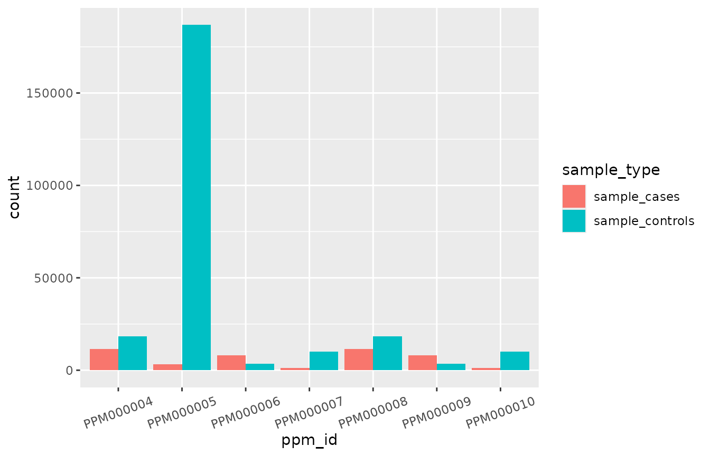

# Exploring PGS scores by Mavaddat et al. (2018)

## Introduction

Let us assume that you are a breast cancer researcher, and that you are
interested in studying the screening and prevention of this disease.
Now, imagine you have just recently noticed a new publication that
claims to have developed a set of new polygenic risk scores that are
both powerful and reliable predictors of breast cancer risk¹.

Perhaps now you would like to investigate a bit more about these new
polygenic risk scores to assess their potential application. You know
that the performance of these scores is dependent on various aspects,
such as study design, participant demographics, case definitions, and
covariates that have been adjusted for. In general, to access this
information, you will have to carefully read the paper searching for
these details, and usually get them from the supplementary material,
with all the extra effort it takes.  
However, if these scores have already been indexed and manually curated
by the [PGS Catalog](https://www.pgscatalog.org/) team, then you can
benefit by using this free and open resource to quickly gather relevant
data about these scores. And if you happen to be an R user, then you can
use the R Package *quincunx* and its retrieval functions to fetch the
polygenic score metadata associated with the publication of interest
from the PGS Catalog REST API server. This is what we will be doing
next.

## Finding polygenic risk scores by publication

### Searching for publications by author name

To check if we are fortunate enough to have the polygenic risk scores
for breast cancer¹ in the PGS Catalog, we start by loading the quincunx
package and by searching for this publication in the PGS Catalog. To do
this we will use the function
[`get_publications()`](https://ascentsoftware.github.io/quincunx/reference/get_publications.md)
and start by searching by the first author’s last name, i.e. “Mavaddat”:

``` r

library(quincunx)
library(dplyr)

pub_by_mavaddat <- get_publications(author = 'Mavaddat') # Not case sensitive,
                                                         # so "mavaddat" would
                                                         # have worked just fine.
```

When you ask the PGS Catalog for publications, it returns an S4
`publications` object with two tables (slots): `publications` and
`pgs_ids`. You can access these tables with the `@` operator.

The `publications` table (data frame) contains all the publications
added to the PGS Catalog that contain an author whose last name is
“Mavaddat”:

``` r

pub_by_mavaddat@publications
#> # A tibble: 6 × 8
#>   pgp_id    pubmed_id publication_date publication   title author_fullname doi  
#>   <chr>         <int> <date>           <chr>         <chr> <chr>           <chr>
#> 1 PGP000001  25855707 2015-04-08       J Natl Cance… Pred… Mavaddat N      10.1…
#> 2 PGP000002  30554720 2018-12-13       Am J Hum Gen… Poly… Mavaddat N      10.1…
#> 3 PGP000033  28376175 2017-07-01       J Natl Cance… Eval… Kuchenbaecker … 10.1…
#> 4 PGP000109  33022221 2020-10-05       Am J Hum Gen… Brea… Kramer I        10.1…
#> 5 PGP000112  32737321 2020-07-31       Nat Commun    Euro… Ho WK           10.1…
#> 6 PGP000117  32665703 2020-07-15       Genet Med     Poly… Barnes DR       10.1…
#> # ℹ 1 more variable: authors <chr>
```

Seemingly there are 6 publications indexed in the PGS Catalog. Each
publication added to the PGS Catalog gets an unique identifier. This
identifier is in the first column (`pgp_id`) of the `publications`
table. The number of publications can be obtained by using the function
[`n()`](https://ascentsoftware.github.io/quincunx/reference/n.md) on the
S4 object `pub_by_mavaddat`, or by asking directly the number of rows of
the `publications` table:

``` r

quincunx::n(pub_by_mavaddat) # Here we use quincunx::n() instead of n() to avoid namespace collisions with dplyr::n().
#> [1] 6
nrow(pub_by_mavaddat@publications)
#> [1] 6
```

Moreover, we can see that Nasim Mavaddat is not the first author in all
these publications because her name is not always present in the column
`author_fullname` (which contains the name of the first author only). If
you want to know all the authors you can access the column `authors`
(contains a string of comma separated author names).

Now, to identify our publication of interest amongst these 6
publications, we can check, for example, the PubMed identifier (column
`pubmed_id`), or check other information such as journal name (column
`publication`), the publication title (column `title`) or the
publication date (column `publication_date`). The most unambiguous
approach is to use the PubMed identifier. The PubMed identifier is
`"30554720"`. So the publication of interest corresponds to the one
returned in row number 2 of the `publications` table:

``` r

publication_row_index <- which(pub_by_mavaddat@publications$pubmed_id == "30554720")
publication_row_index
#> [1] 2
```

To focus now on this publication and filter out the others, we can
subset the `publications` object `pub_by_mavaddat`, e.g., by position,
and get a new object with both tables (`publications` and `pgs_ids`)
filtered for only this publication:

``` r

mavaddat2018 <- pub_by_mavaddat[publication_row_index]
mavaddat2018
#> An object of class "publications"
#> Slot "publications":
#> # A tibble: 1 × 8
#>   pgp_id    pubmed_id publication_date publication   title author_fullname doi  
#>   <chr>         <int> <date>           <chr>         <chr> <chr>           <chr>
#> 1 PGP000002  30554720 2018-12-13       Am J Hum Gen… Poly… Mavaddat N      10.1…
#> # ℹ 1 more variable: authors <chr>
#> 
#> Slot "pgs_ids":
#> # A tibble: 15 × 3
#>    pgp_id    pgs_id    stage   
#>    <chr>     <chr>     <chr>   
#>  1 PGP000002 PGS000004 gwas/dev
#>  2 PGP000002 PGS000005 gwas/dev
#>  3 PGP000002 PGS000006 gwas/dev
#>  4 PGP000002 PGS000007 gwas/dev
#>  5 PGP000002 PGS000008 gwas/dev
#>  6 PGP000002 PGS000009 gwas/dev
#>  7 PGP000002 PGS000001 eval    
#>  8 PGP000002 PGS000002 eval    
#>  9 PGP000002 PGS000003 eval    
#> 10 PGP000002 PGS000004 eval    
#> 11 PGP000002 PGS000005 eval    
#> 12 PGP000002 PGS000006 eval    
#> 13 PGP000002 PGS000007 eval    
#> 14 PGP000002 PGS000008 eval    
#> 15 PGP000002 PGS000009 eval
```

We see now that the `publications` table contains one entry only, and
that the PGS Catalog identifier assigned to this publication is
PGP000002:

``` r

mavaddat2018@publications$pgp_id
#> [1] "PGP000002"
```

In the `pgs_ids` we see that there are several PGS scores associated
with publication PGP000002. Besides listing the score identifiers
(`pgs_id`), it also includes the `stage` column that annotates the
polygenic score relative to the PGS construction process (check page 2
of the [quincunx
cheatsheet](https://github.com/ramiromagno/cheatsheets/blob/master/quincunx/quincunx_cheatsheet.pdf)
for a visual illustration).

### Searching for publications by PubMed ID

An alternatively, albeit more direct, route to get this publication
could have been to query for publications directly by the corresponding
PubMed ID (30554720):

``` r

pub_by_pmid_30554720 <- get_publications(pubmed_id = '30554720')
pub_by_pmid_30554720
#> An object of class "publications"
#> Slot "publications":
#> # A tibble: 1 × 8
#>   pgp_id    pubmed_id publication_date publication   title author_fullname doi  
#>   <chr>         <int> <date>           <chr>         <chr> <chr>           <chr>
#> 1 PGP000002  30554720 2018-12-13       Am J Hum Gen… Poly… Mavaddat N      10.1…
#> # ℹ 1 more variable: authors <chr>
#> 
#> Slot "pgs_ids":
#> # A tibble: 15 × 3
#>    pgp_id    pgs_id    stage   
#>    <chr>     <chr>     <chr>   
#>  1 PGP000002 PGS000004 gwas/dev
#>  2 PGP000002 PGS000005 gwas/dev
#>  3 PGP000002 PGS000006 gwas/dev
#>  4 PGP000002 PGS000007 gwas/dev
#>  5 PGP000002 PGS000008 gwas/dev
#>  6 PGP000002 PGS000009 gwas/dev
#>  7 PGP000002 PGS000001 eval    
#>  8 PGP000002 PGS000002 eval    
#>  9 PGP000002 PGS000003 eval    
#> 10 PGP000002 PGS000004 eval    
#> 11 PGP000002 PGS000005 eval    
#> 12 PGP000002 PGS000006 eval    
#> 13 PGP000002 PGS000007 eval    
#> 14 PGP000002 PGS000008 eval    
#> 15 PGP000002 PGS000009 eval
```

To get an overview of the possible search criteria for
`get_publications` you can use the help function within R.

``` r

?get_publications

# or alternatively
help("get_publications")
```

## From publication to polygenic risk scores

Now that we have found that our publication of interest exists in the
PGS Catalog, with identifier PGP000002, we can check now which polygenic
risk scores are annotated in the Catalog. Polygenic scores (PGS) in the
PGS Catalog are indexed by an unique accession identifier of the form:
“PGS000000” (“PGS” followed by six digits).

To get all PGS identifiers associated with Mavaddat’s publication we
turn to the second table `pgs_ids` that maps publication identifiers
(PGP) to PGS identifiers:

``` r

pub_by_pmid_30554720@pgs_ids
#> # A tibble: 15 × 3
#>    pgp_id    pgs_id    stage   
#>    <chr>     <chr>     <chr>   
#>  1 PGP000002 PGS000004 gwas/dev
#>  2 PGP000002 PGS000005 gwas/dev
#>  3 PGP000002 PGS000006 gwas/dev
#>  4 PGP000002 PGS000007 gwas/dev
#>  5 PGP000002 PGS000008 gwas/dev
#>  6 PGP000002 PGS000009 gwas/dev
#>  7 PGP000002 PGS000001 eval    
#>  8 PGP000002 PGS000002 eval    
#>  9 PGP000002 PGS000003 eval    
#> 10 PGP000002 PGS000004 eval    
#> 11 PGP000002 PGS000005 eval    
#> 12 PGP000002 PGS000006 eval    
#> 13 PGP000002 PGS000007 eval    
#> 14 PGP000002 PGS000008 eval    
#> 15 PGP000002 PGS000009 eval
```

Please note that there are 9 unique scores, both from the *development*
and the *evaluation* stages, meaning that this paper published new
polygenic scores (*development* stage), and tested them (*evaluation*
stage). But this paper has also evaluated 3 other polygenic scores
previously developed (and firstly published in another publication by
the same author). This distinction between stages is important because
when we query the database for the scores from all the pgp_ids present
in this publication, only the newly developed ones (from the
*development stage*) will be retrieved. (See below: section about the
[`get_scores()`](https://ascentsoftware.github.io/quincunx/reference/get_scores.md)
function).

``` r

# Newly published PGS scores (development stage)
pub_by_pmid_30554720@pgs_ids |> dplyr::filter(stage == "gwas/dev")
#> # A tibble: 6 × 3
#>   pgp_id    pgs_id    stage   
#>   <chr>     <chr>     <chr>   
#> 1 PGP000002 PGS000004 gwas/dev
#> 2 PGP000002 PGS000005 gwas/dev
#> 3 PGP000002 PGS000006 gwas/dev
#> 4 PGP000002 PGS000007 gwas/dev
#> 5 PGP000002 PGS000008 gwas/dev
#> 6 PGP000002 PGS000009 gwas/dev

# All PGS scores evaluated (evaluation stage)  
pub_by_pmid_30554720@pgs_ids |> dplyr::filter(stage == "eval") 
#> # A tibble: 9 × 3
#>   pgp_id    pgs_id    stage
#>   <chr>     <chr>     <chr>
#> 1 PGP000002 PGS000001 eval 
#> 2 PGP000002 PGS000002 eval 
#> 3 PGP000002 PGS000003 eval 
#> 4 PGP000002 PGS000004 eval 
#> 5 PGP000002 PGS000005 eval 
#> 6 PGP000002 PGS000006 eval 
#> 7 PGP000002 PGS000007 eval 
#> 8 PGP000002 PGS000008 eval 
#> 9 PGP000002 PGS000009 eval
```

If we knew, before hand, that PGP000002 was associated with Mavaddat’s
publication, we could have also taken advantage of the neat function
[`pgp_to_pgs()`](https://ascentsoftware.github.io/quincunx/reference/pgp_to_pgs.md)
to quickly get all the associated polygenic score ids:

``` r

pgp_to_pgs('PGP000002')
#> # A tibble: 15 × 3
#>    pgp_id    pgs_id    stage   
#>    <chr>     <chr>     <chr>   
#>  1 PGP000002 PGS000004 gwas/dev
#>  2 PGP000002 PGS000005 gwas/dev
#>  3 PGP000002 PGS000006 gwas/dev
#>  4 PGP000002 PGS000007 gwas/dev
#>  5 PGP000002 PGS000008 gwas/dev
#>  6 PGP000002 PGS000009 gwas/dev
#>  7 PGP000002 PGS000001 eval    
#>  8 PGP000002 PGS000002 eval    
#>  9 PGP000002 PGS000003 eval    
#> 10 PGP000002 PGS000004 eval    
#> 11 PGP000002 PGS000005 eval    
#> 12 PGP000002 PGS000006 eval    
#> 13 PGP000002 PGS000007 eval    
#> 14 PGP000002 PGS000008 eval    
#> 15 PGP000002 PGS000009 eval
```

## Polygenic Scores published by Mavaddat *et al.* (2018)

To dive into the metadata about these polygenic scores, we use the
quincunx function
[`get_scores()`](https://ascentsoftware.github.io/quincunx/reference/get_scores.md):

``` r

mavaddat2018_scores <- get_scores(pubmed_id = "30554720")
slotNames(mavaddat2018_scores)
#> [1] "scores"                     "publications"              
#> [3] "samples"                    "demographics"              
#> [5] "cohorts"                    "traits"                    
#> [7] "stages_tally"               "ancestry_frequencies"      
#> [9] "multi_ancestry_composition"
```

This returns the S4 object `scores` which contains six tables (slots):
scores, publications, samples, demographics, cohorts, traits,
stages_tally, ancestry_frequencies, multi_ancestry_composition.  
You can quickly check all variables from each table by consulting
[quincunx
cheatsheet](https://github.com/ramiromagno/cheatsheets/blob/master/quincunx/quincunx_cheatsheet.pdf).  
A description of each variable is annotated in the `scores` object help
page that can be accessed with
[`class?scores`](https://ascentsoftware.github.io/quincunx/reference/scores-class.md).

## Polygenic Scores Metadata

### scores object \| scores table

The S4 scores object `mavaddat2018_scores` starts with a table named
`scores` that lists each score in one row. All scores are identified by
a PGS identifier (`pgs_id` column). Note that, as previously explained,
only the polygenic scores newly developed in this publication
(*developmental stage*) are retrieved, and not all the PGS scores that
were evaluated in this publication.

In addition, scores can have a name (`pgs_name` column). This may be the
name assigned by authors of the source publication, or a name assigned
by a PGS Catalog curator in order to identify that particular score
throughout the curating process.

``` r

mavaddat2018_scores@scores[c('pgs_id', 'pgs_name')]
#> # A tibble: 6 × 2
#>   pgs_id    pgs_name     
#>   <chr>     <chr>        
#> 1 PGS000004 PRS313_BC    
#> 2 PGS000005 PRS313_ERpos 
#> 3 PGS000006 PRS313_ERneg 
#> 4 PGS000007 PRS3820_BC   
#> 5 PGS000008 PRS3820_ERpos
#> 6 PGS000009 PRS3820_ERneg
```

From the PGS names we can already see the presence of the suffixes
“ERpos” and “ERneg”, suggestive of specialized polygenic risk scores for
estrogen-receptor positive and negative samples.

``` r

mavaddat2018_scores@scores['scoring_file']
#> # A tibble: 6 × 1
#>   scoring_file                                                                  
#>   <chr>                                                                         
#> 1 https://ftp.ebi.ac.uk/pub/databases/spot/pgs/scores/PGS000004/ScoringFiles/PG…
#> 2 https://ftp.ebi.ac.uk/pub/databases/spot/pgs/scores/PGS000005/ScoringFiles/PG…
#> 3 https://ftp.ebi.ac.uk/pub/databases/spot/pgs/scores/PGS000006/ScoringFiles/PG…
#> 4 https://ftp.ebi.ac.uk/pub/databases/spot/pgs/scores/PGS000007/ScoringFiles/PG…
#> 5 https://ftp.ebi.ac.uk/pub/databases/spot/pgs/scores/PGS000008/ScoringFiles/PG…
#> 6 https://ftp.ebi.ac.uk/pub/databases/spot/pgs/scores/PGS000009/ScoringFiles/PG…
```

The column `scoring_file` contains the URL for the FTP location
containing the corresponding PGS scoring files. PGS scoring files are
the text files provided by the PGS Catalog team containing the source
data that you can use to compute polygenic scores for particular
individuals, i.e. that allow you to apply these scores to your
individual samples. Learn more about scoring files in
[`vignette("pgs-scoring-file")`](https://ascentsoftware.github.io/quincunx/articles/pgs-scoring-file.md).
For a quick consultation of the file format of PGS scoring files you may
also check the second page of [quincunx
cheatsheet](https://github.com/ramiromagno/cheatsheets/blob/master/quincunx/quincunx_cheatsheet.pdf).

As an additional feature, *quincunx* allows you to download the relevant
PGS scoring files directly into R using the function
[`read_scoring_file()`](https://ascentsoftware.github.io/quincunx/reference/read_scoring_file.md),
making the data immediately available in R for further analysis.

``` r

mavaddat2018_scores@scores[c('pgs_id', 'matches_publication')]
#> # A tibble: 6 × 2
#>   pgs_id    matches_publication
#>   <chr>     <lgl>              
#> 1 PGS000004 TRUE               
#> 2 PGS000005 TRUE               
#> 3 PGS000006 TRUE               
#> 4 PGS000007 TRUE               
#> 5 PGS000008 TRUE               
#> 6 PGS000009 TRUE
```

The column `matches_publication` is a logical value indicating whether
the published polygenic score is exactly the same as the one present in
the PGS scoring file provided by the PGS Catalog. In this case all of
the 6 scores are provided exactly as published (all values are “TRUE”).

Other columns in the `scores` table hold relevant information.

``` r

mavaddat2018_scores@scores[c('pgs_name', 'pgs_method_name', 'pgs_method_params', 'n_variants', 'assembly')]
#> # A tibble: 6 × 5
#>   pgs_name      pgs_method_name            pgs_method_params n_variants assembly
#>   <chr>         <chr>                      <chr>                  <int> <chr>   
#> 1 PRS313_BC     Hard-Thresholding Stepwis… p < 10^-5                313 GRCh37  
#> 2 PRS313_ERpos  Hard-Thresholding Stepwis… p < 10^-5                313 GRCh37  
#> 3 PRS313_ERneg  Hard-Thresholding Stepwis… p < 10^-5                313 GRCh37  
#> 4 PRS3820_BC    LASSO penalized regression p < 0.001               3820 GRCh37  
#> 5 PRS3820_ERpos LASSO penalized regression p < 0.001               3820 GRCh37  
#> 6 PRS3820_ERneg LASSO penalized regression p < 0.001               3820 GRCh37
```

For example, columns such as `pgs_method_name` and `pgs_method_params`
provide extra details about the PGS development method. Finally,
`n_variants` informs about the number of variants comprising each
polygenic risk score, and `assembly` indicates the genome assembly
version used.

### scores object \| publications table

The `scores` S4 object contains a table dedicated to the source
publications used to collect the score(s) retrieved. In this case, it is
not surprising that all PGS scores map to the same publication
identifier, i.e., PGP000002, as that was our starting point.

``` r

mavaddat2018_scores@publications[c('pgs_id', 'pgp_id', 'publication_date', 'author_fullname')]
#> # A tibble: 6 × 4
#>   pgs_id    pgp_id    publication_date author_fullname
#>   <chr>     <chr>     <date>           <chr>          
#> 1 PGS000004 PGP000002 2018-12-13       Mavaddat N     
#> 2 PGS000005 PGP000002 2018-12-13       Mavaddat N     
#> 3 PGS000006 PGP000002 2018-12-13       Mavaddat N     
#> 4 PGS000007 PGP000002 2018-12-13       Mavaddat N     
#> 5 PGS000008 PGP000002 2018-12-13       Mavaddat N     
#> 6 PGS000009 PGP000002 2018-12-13       Mavaddat N
```

### scores object \| samples table

The third table (slot) of the `scores` S4 object pertains to the samples
used for the development of the PGS scores.

There are a total of 15 columns with metadata details about each sample.
Each row corresponds to one sample associated with the polygenic scores,
and the combination of values of the first two columns, `pgs_id` and
`sample_id`, uniquely identifies each sample in this table. All samples
shown in the `samples` table of a `scores` object are annotated with a
`stage`, that can take two values: `"discovery"` or `"training"`.  
The `"discovery"` samples are typically used in determining the variants
that are afterwards used for polygenic score development. These variants
originate typically from Genome-Wide Association Studies (GWAS). Hence,
these samples might be linked to the GWAS Catalog. If that is the case,
this information is provided in the column `study_id`, indicating the
GWAS Catalog accession identifier. You may find more information about
these GWAS studies by using the function `gwasrapidd::get_studies()`
from the [gwasrapidd](https://rmagno.eu/gwasrapidd/) R package that we
developed previously².  
The `"training"` samples are those that have been used for the training
of a particular polygenic score. Together, these two stages (*discovery*
and *training*) are referred to as *development*, in contrast to the
later testing phase of the polygenic scores, i.e., the *evaluation*
phase (or stage).  
If this sounds confusing check our
[cheatsheet](https://github.com/ramiromagno/cheatsheets/blob/master/quincunx/quincunx_cheatsheet.pdf),
section *PGS Construction Process*, second page.

``` r

dplyr::glimpse(mavaddat2018_scores@samples)
#> Rows: 12
#> Columns: 15
#> $ pgs_id                          <chr> "PGS000004", "PGS000004", "PGS000005",…
#> $ sample_id                       <int> 1, 2, 1, 2, 1, 2, 1, 2, 1, 2, 1, 2
#> $ stage                           <chr> "gwas", "dev", "gwas", "dev", "gwas", …
#> $ sample_size                     <int> 158648, 10444, 87368, 5159, 87368, 515…
#> $ sample_cases                    <int> 88916, 5159, 55391, 4233, 15404, 926, …
#> $ sample_controls                 <int> 69732, 5285, 31977, 926, 71964, 4233, …
#> $ sample_percent_male             <dbl> 0, 0, 0, 0, 0, 0, 0, 0, 0, 0, 0, 0
#> $ phenotype_description           <chr> "Invasive breast cancer-affected", "In…
#> $ ancestry_category               <chr> "European", "European", "European", "E…
#> $ ancestry                        <chr> NA, NA, NA, NA, NA, NA, NA, NA, NA, NA…
#> $ country                         <chr> NA, NA, NA, NA, NA, NA, NA, NA, NA, NA…
#> $ ancestry_additional_description <chr> NA, NA, NA, NA, NA, NA, NA, NA, NA, NA…
#> $ study_id                        <chr> NA, NA, NA, NA, NA, NA, NA, NA, NA, NA…
#> $ pubmed_id                       <int> NA, NA, NA, NA, NA, NA, NA, NA, NA, NA…
#> $ cohorts_additional_description  <chr> "Training Cohort", "Validation Cohort"…
```

The PGS Catalog provides brief records of samples sizes (total number,
number of cases, and number of controls):

``` r

mavaddat2018_scores@samples[1:6]
#> # A tibble: 12 × 6
#>    pgs_id    sample_id stage sample_size sample_cases sample_controls
#>    <chr>         <int> <chr>       <int>        <int>           <int>
#>  1 PGS000004         1 gwas       158648        88916           69732
#>  2 PGS000004         2 dev         10444         5159            5285
#>  3 PGS000005         1 gwas        87368        55391           31977
#>  4 PGS000005         2 dev          5159         4233             926
#>  5 PGS000006         1 gwas        87368        15404           71964
#>  6 PGS000006         2 dev          5159          926            4233
#>  7 PGS000007         1 gwas       158648        88916           69732
#>  8 PGS000007         2 dev         10444         5159            5285
#>  9 PGS000008         1 gwas        87368        55391           31977
#> 10 PGS000008         2 dev          5159         4233             926
#> 11 PGS000009         1 gwas        87368        15404           71964
#> 12 PGS000009         2 dev          5159          926            4233
```

Perhaps, not so surprisingly, the percentage of male participants in the
training samples is zero:

``` r

mavaddat2018_scores@samples[c('pgs_id', 'sample_id', 'stage', 'sample_percent_male')]
#> # A tibble: 12 × 4
#>    pgs_id    sample_id stage sample_percent_male
#>    <chr>         <int> <chr>               <dbl>
#>  1 PGS000004         1 gwas                    0
#>  2 PGS000004         2 dev                     0
#>  3 PGS000005         1 gwas                    0
#>  4 PGS000005         2 dev                     0
#>  5 PGS000006         1 gwas                    0
#>  6 PGS000006         2 dev                     0
#>  7 PGS000007         1 gwas                    0
#>  8 PGS000007         2 dev                     0
#>  9 PGS000008         1 gwas                    0
#> 10 PGS000008         2 dev                     0
#> 11 PGS000009         1 gwas                    0
#> 12 PGS000009         2 dev                     0
```

Also, information about the trait or disease studied and ancestry
information can be accessed:

``` r

mavaddat2018_scores@samples[c('pgs_id', 'sample_id', 'stage', 'phenotype_description', 'ancestry')]
#> # A tibble: 12 × 5
#>    pgs_id    sample_id stage phenotype_description           ancestry
#>    <chr>         <int> <chr> <chr>                           <chr>   
#>  1 PGS000004         1 gwas  Invasive breast cancer-affected NA      
#>  2 PGS000004         2 dev   Invasive breast cancer-affected NA      
#>  3 PGS000005         1 gwas  ER-positive breast cancer cases NA      
#>  4 PGS000005         2 dev   ER-positive breast cancer cases NA      
#>  5 PGS000006         1 gwas  ER-negative breast cancer cases NA      
#>  6 PGS000006         2 dev   ER-negative breast cancer cases NA      
#>  7 PGS000007         1 gwas  Invasive breast cancer-affected NA      
#>  8 PGS000007         2 dev   Invasive breast cancer-affected NA      
#>  9 PGS000008         1 gwas  ER-positive breast cancer cases NA      
#> 10 PGS000008         2 dev   ER-positive breast cancer cases NA      
#> 11 PGS000009         1 gwas  ER-negative breast cancer cases NA      
#> 12 PGS000009         2 dev   ER-negative breast cancer cases NA
```

Again, not so surprisingly, all samples are of European ancestry, a bias
recognized by the research community. You can find more details about
the ancestry variable in the `ancestry_categories` column. These
categories have been defined within the NHGRI-EBI GWAS Catalog
framework. We provide these ancestry nomenclature in *quincunx* as a
separate dataset named `ancestry_categories`. See
[`?ancestry_categories`](https://ascentsoftware.github.io/quincunx/reference/ancestry_categories.md)
more details. To quickly lookup the definition of the *European*
ancestry:

``` r

# Quick look at the ancestries definitions
ancestry_categories
#> # A tibble: 19 × 6
#>    ancestry_category  ancestry_class ancestry_class_symbol ancestry_class_colour
#>    <chr>              <chr>          <chr>                 <chr>                
#>  1 Aboriginal Austra… Additional Di… OTH                   #999999              
#>  2 African American … African        AFR                   #FFD900              
#>  3 African unspecifi… African        AFR                   #FFD900              
#>  4 Asian unspecified  Additional As… ASN                   #B15928              
#>  5 Central Asian      Additional As… ASN                   #B15928              
#>  6 East Asian         East Asian     EAS                   #4DAF4A              
#>  7 European           European       EUR                   #377EB8              
#>  8 Greater Middle Ea… Greater Middl… GME                   #00CED1              
#>  9 Hispanic or Latin… Hispanic or L… AMR                   #E41A1C              
#> 10 Native American    Additional Di… OTH                   #999999              
#> 11 Not reported       Ancestry Not … NR                    #BBBBBB              
#> 12 Oceanian           Additional Di… OTH                   #999999              
#> 13 Other              Additional Di… OTH                   #999999              
#> 14 Other admixed anc… Additional Di… OTH                   #999999              
#> 15 South Asian        South Asian    SAS                   #984EA3              
#> 16 South East Asian   Additional As… ASN                   #B15928              
#> 17 Sub-Saharan Afric… African        AFR                   #FFD900              
#> 18 Multi-Ancestry (i… Multi-Ancestr… MAE                   #A6CEE3              
#> 19 Multi-Ancestry (e… Multi-Ancestr… MAO                   #FF7F00              
#> # ℹ 2 more variables: definition <chr>, examples <chr>
```

### scores object \| demographics table

The demographics table usually lists demographic information about each
sample. For this study this table is however empty, meaning that this
information was either not available from Mavaddat’s publication, or not
included in the PGS Catalog.

``` r

mavaddat2018_scores@demographics
#> # A tibble: 0 × 11
#> # ℹ 11 variables: pgs_id <chr>, sample_id <int>, variable <chr>,
#> #   estimate_type <chr>, unit <chr>, variability_type <chr>, variability <dbl>,
#> #   estimate <dbl>, interval_type <chr>, interval_lower <dbl>,
#> #   interval_upper <dbl>
```

Nevertheless, the demographics variables, when present, are follow-up
time, and age of study participants.

If you want to confirm that *quincunx* is retrieving exactly the same
info as provided by the PGS Catalog web interface, you can always check
this by showing online the metadata for your PGP publication of interest
using the function `open_in_pgs_catalog`.

``` r

open_in_pgs_catalog('PGP000002', pgs_catalog_entity = 'pgp')
```

### scores object \| cohorts table

In the cohorts table you can check which cohorts are associated with
which samples. Note that the unique identification of a sample is given
by the combination of the values of the first two columns: `pgs_id`, and
`sample_id`.  
To learn more about the meaning of cohorts for the PGS Catalog, visit
our check our
[cheatsheet](https://github.com/ramiromagno/cheatsheets/blob/master/quincunx/quincunx_cheatsheet.pdf),
section *Cohorts, Samples and Sample Sets*, second page.

``` r

mavaddat2018_scores@cohorts
#> # A tibble: 558 × 4
#>    pgs_id    sample_id cohort_symbol cohort_name                                
#>    <chr>         <int> <chr>         <chr>                                      
#>  1 PGS000004         1 ABCFS         Australian Breast Cancer Family Study      
#>  2 PGS000004         1 MCCS          Melbourne Collaborative Cohort Study       
#>  3 PGS000004         1 HMBCS         Hannover-Minsk Breast Cancer Study         
#>  4 PGS000004         1 LMBC          Leuven Multidisciplinary Breast Centre     
#>  5 PGS000004         1 MTLGEBCS      Montreal Gene-Environment Breast Cancer St…
#>  6 PGS000004         1 CGPS          Copenhagen General Population Study        
#>  7 PGS000004         1 KBCP          Kuopio Breast Cancer Project               
#>  8 PGS000004         1 OBCS          Oulu Breast Cancer Study                   
#>  9 PGS000004         1 CECILE        CECILE Breast Cancer Study                 
#> 10 PGS000004         1 BBCC          Bavarian Breast Cancer Cases and Controls  
#> # ℹ 548 more rows
```

### scores object \| traits table

Finally, in the traits table, you have access to the traits (phenotypes)
associated with these polygenic scores. In this study, all scores
indicate “breast cancer” or one of its subtypes (column `trait`):

``` r

mavaddat2018_scores@traits[c('pgs_id', 'efo_id', 'trait')]
#> # A tibble: 6 × 3
#>   pgs_id    efo_id        trait                                   
#>   <chr>     <chr>         <chr>                                   
#> 1 PGS000004 MONDO_0004989 breast carcinoma                        
#> 2 PGS000005 MONDO_0006512 estrogen-receptor positive breast cancer
#> 3 PGS000006 MONDO_0006513 estrogen-receptor negative breast cancer
#> 4 PGS000007 MONDO_0004989 breast carcinoma                        
#> 5 PGS000008 MONDO_0006512 estrogen-receptor positive breast cancer
#> 6 PGS000009 MONDO_0006513 estrogen-receptor negative breast cancer
```

Compared to the author-reported trait (column `reported_trait` from
table `scores`), the trait description in this table follows the
controlled vocabulary of an ontology, i.e., the [Experimental Factor
Ontology (EFO)](https://www.ebi.ac.uk/efo/). This way, traits are
described objectively. This is very useful for comparing trait data
among different studies where different reported trait descriptions
might have been used. For example, if you want now to know what other
polygenic scores may be deposited in the PGS Catalog that also study
breast cancer — namely, breast carcinoma, estrogen-receptor positive
breast cancer, or estrogen-receptor negative breast cancer — then you
could use their respective EFO identifiers (MONDO_0004989,
MONDO_0006512, or MONDO_0006513) with the function
[`get_scores()`](https://ascentsoftware.github.io/quincunx/reference/get_scores.md):

``` r

scores_bc <- get_scores(efo_id = unique(mavaddat2018_scores@traits[['efo_id']]))
#>  ■■■■■■■■■■■                       33% |  ETA: 19s
#>  ■■■■■■■■■■■■■■■■■■■■■             67% |  ETA:  6s
quincunx::n(scores_bc)
#> [1] 166
```

So there are 166 scores present in the PGS Catalog. Included in this set
are the 6 scores originating from [Mavaddat et
al. (2018)](https://doi.org/10.1016/j.ajhg.2018.11.002). If we want to
proceed with analysing these other scores without including those from
the Mavaddat’s study, we could use the function
[`setdiff()`](https://ascentsoftware.github.io/quincunx/reference/setop.md)
to remove them from the S4 `scores` object:

``` r

# Use quincunx::setdiff to avoid collision with dplyr::setdiff()
bc_scores_not_mavaddat2018 <- quincunx::setdiff(scores_bc, mavaddat2018_scores)
quincunx::n(bc_scores_not_mavaddat2018)
#> [1] 160
bc_scores_not_mavaddat2018@scores[c('pgs_id', 'reported_trait','n_variants')]
#> # A tibble: 160 × 3
#>    pgs_id    reported_trait n_variants
#>    <chr>     <chr>               <int>
#>  1 PGS000001 Breast cancer          77
#>  2 PGS000015 Breast cancer        5218
#>  3 PGS000028 Breast cancer          83
#>  4 PGS000029 Breast cancer          76
#>  5 PGS000045 Breast cancer          88
#>  6 PGS000050 Breast cancer          44
#>  7 PGS000051 Breast cancer          67
#>  8 PGS000052 Breast cancer         161
#>  9 PGS000072 Breast cancer         187
#> 10 PGS000153 Breast cancer          66
#> # ℹ 150 more rows
```

For other set operations, check their documentation page:
[`union()`](https://ascentsoftware.github.io/quincunx/reference/setop.md),
[`intersect()`](https://ascentsoftware.github.io/quincunx/reference/setop.md)
and
[`setequal()`](https://ascentsoftware.github.io/quincunx/reference/setop.md).

## Performance Metrics

According to the PGS Catalog team³:

> “Performance Metrics assess the validity of a PGS in a Sample Set,
> independent of the samples used for score development. Common metrics
> include standardised effect sizes (odds/hazard ratios \[OR/HR\], and
> regression coefficients \[Beta\]), classification accuracy metrics
> (e.g. AUROC, C-index, AUPRC), but other relevant metrics
> (e.g. calibration \[Chi-square\]) can also be recorded. The covariates
> used in the model (most commonly age, sex, and genetic principal
> components (PCs) to account of population structure) are also linking
> to each set of metrics. Multiple PGS can be evaluated on the same
> Sample Set and further indexed as directly comparable Performance
> Metrics.”

In this section we will learn how to retrieve details about the
evaluation of the polygenic scores developed in Mavaddat *et al.*
(2018). To do this, we start by querying the performance metrics for our
scores of interest.

Please recall that the `pgs_ids` and `reported_traits` for the polygenic
scores newly developed in Mavaddat’s publication are:

``` r

mavaddat2018_scores@scores[c('pgs_id', 'reported_trait')]
#> # A tibble: 6 × 2
#>   pgs_id    reported_trait           
#>   <chr>     <chr>                    
#> 1 PGS000004 Breast cancer            
#> 2 PGS000005 ER-positive breast cancer
#> 3 PGS000006 ER-negative breast cancer
#> 4 PGS000007 Breast cancer            
#> 5 PGS000008 ER-positive breast cancer
#> 6 PGS000009 ER-negative breast cancer
```

So we use these PGS identifiers to query the PGS Catalog for performance
metrics using the function
[`get_performance_metrics()`](https://ascentsoftware.github.io/quincunx/reference/get_performance_metrics.md).

``` r

mavaddat2018_ppm <- get_performance_metrics(pgs_id = mavaddat2018_scores@scores$pgs_id)
#>  ■■■■■■                            17% |  ETA:  2m
#>  ■■■■■■■■■■■                       33% |  ETA:  1m
#>  ■■■■■■■■■■■■■■■■                  50% |  ETA:  1m
#>  ■■■■■■■■■■■■■■■■■■■■■             67% |  ETA: 26s
```

The output is an S4 object with 9 tables:

- performance_metrics, publications, sample_sets, samples, demographics,
  cohorts, pgs_effect_sizes, pgs_classification_metrics, and
  pgs_other_metrics.

Reminder \| You can quickly check all variables from each table by
consulting [quincunx
cheatsheet](https://github.com/ramiromagno/cheatsheets/blob/master/quincunx/quincunx_cheatsheet.pdf).  
Also, a description of each variable is annotated in the
`performance_metrics` object help page that can be accessed with
[`class?performance_metrics`](https://ascentsoftware.github.io/quincunx/reference/performance_metrics-class.md).

### performance_metrics object \| performance_metrics table

In the first table `performance_metrics` we get one performance metrics
entity per row, with the following columns: ppm_id, pgs_id,
reported_trait, covariates, comments.  
Note that all performance metrics are indexed with an unique identifier
that starts with “PPM”.

``` r

mavaddat2018_ppm@performance_metrics[1:4]
#> # A tibble: 178 × 4
#>    ppm_id    pgs_id    reported_trait                                 covariates
#>    <chr>     <chr>     <chr>                                          <chr>     
#>  1 PPM000004 PGS000004 Invasive breast cancer                         study, ge…
#>  2 PPM000005 PGS000004 Incident breast cancer cases                   study, ge…
#>  3 PPM000650 PGS000004 Breast cancer intrinsic-like subtype (luminal… NA        
#>  4 PPM000653 PGS000004 Breast cancer intrinsic-like subtype (luminal… NA        
#>  5 PPM000656 PGS000004 Breast cancer intrinsic-like subtype (luminal… NA        
#>  6 PPM000659 PGS000004 Breast cancer intrinsic-like subtype (HER2-en… NA        
#>  7 PPM000662 PGS000004 Breast cancer intrinsic-like subtype (triple … NA        
#>  8 PPM000934 PGS000004 Metachronous contralateral breast cancer       Country   
#>  9 PPM000935 PGS000004 Metachronous contralateral breast cancer       Country, …
#> 10 PPM000936 PGS000004 Invasive metachronous contralateral breast ca… Country   
#> # ℹ 168 more rows
```

According to the PGS Catalog documentation
(<http://www.pgscatalog.org/docs/>):

- The `reported_trait` displays the reported trait, often corresponding
  to the test set names reported in the publication, or more specific
  aspects of the phenotype being tested (e.g. if the disease cases are
  incident vs. recurrent events).  
- The `covariates` column lists the covariates used in the prediction
  model to evaluate the PGS. Examples include: age, sex, smoking habits,
  etc.  
- The `comments` column is a field where additional relevant information
  can be added to aid with understanding a particular performance
  metrics.

Looking at the `performance_metrics` table, we can see that one
polygenic score (`pgs_id`) can be associated with several performance
metrics (`ppm_id`), e.g., PGS000007 associates with 10 PPMs:

``` r

dplyr::filter(mavaddat2018_ppm@performance_metrics, pgs_id == 'PGS000007')
#> # A tibble: 10 × 5
#>    ppm_id    pgs_id    reported_trait                   covariates      comments
#>    <chr>     <chr>     <chr>                            <chr>           <chr>   
#>  1 PPM000008 PGS000007 Invasive breast cancer           study, genetic… NA      
#>  2 PPM000384 PGS000007 Breast Cancer (personal history) age at menarche NA      
#>  3 PPM000386 PGS000007 Breast Cancer (personal history) age, sex        NA      
#>  4 PPM000388 PGS000007 Breast Cancer (personal history) NA              NA      
#>  5 PPM005160 PGS000007 Breast cancer                    Age, family hi… NA      
#>  6 PPM005163 PGS000007 Breast cancer                    Age, family hi… NA      
#>  7 PPM005169 PGS000007 Breast cancer                    NA              NA      
#>  8 PPM005172 PGS000007 Breast cancer                    NA              NA      
#>  9 PPM015517 PGS000007 Breast cancer                    4 genetic PCs   NA      
#> 10 PPM023068 PGS000007 Breast cancer                    age, 10 PCs     NA
```

This means that the polygenic score (PGS000007) has been validated
several times, using different models. In this case, we can immediately
see that PGS000007 performance has been evaluated, for example, for
alternative breast cancer types (different `reported_traits`), namely:

- Invasive breast cancer, Breast Cancer (personal history), Breast
  cancer.

Additionally, we can see that the same `reported_trait` (*Breast Cancer
(personal history)*) has been validated by 3 different performance
metrics (PPMs): PPM000384, PPM000386, PPM000388; each having included
different covariates in the model: age at menarche, age, sex, NA. (NA
means that data for this field is *Not Available* in the records).

### performance_metrics object \| publications table

The publications table is dedicated to hold information related to the
publications associated with the performance metrics. The column
`pgp_id` links each performance metrics to the respective publication
where that performance metrics was reported and collected.

``` r

mavaddat2018_ppm@publications
#> # A tibble: 178 × 8
#>    ppm_id    pgp_id pubmed_id publication_date publication title author_fullname
#>    <chr>     <chr>      <int> <date>           <chr>       <chr> <chr>          
#>  1 PPM000004 PGP00…  30554720 2018-12-13       Am J Hum G… Poly… Mavaddat N     
#>  2 PPM000005 PGP00…  30554720 2018-12-13       Am J Hum G… Poly… Mavaddat N     
#>  3 PPM000650 PGP00…  32424353 2020-05-18       Nat Genet   Geno… Zhang H        
#>  4 PPM000653 PGP00…  32424353 2020-05-18       Nat Genet   Geno… Zhang H        
#>  5 PPM000656 PGP00…  32424353 2020-05-18       Nat Genet   Geno… Zhang H        
#>  6 PPM000659 PGP00…  32424353 2020-05-18       Nat Genet   Geno… Zhang H        
#>  7 PPM000662 PGP00…  32424353 2020-05-18       Nat Genet   Geno… Zhang H        
#>  8 PPM000934 PGP00…  33022221 2020-10-05       Am J Hum G… Brea… Kramer I       
#>  9 PPM000935 PGP00…  33022221 2020-10-05       Am J Hum G… Brea… Kramer I       
#> 10 PPM000936 PGP00…  33022221 2020-10-05       Am J Hum G… Brea… Kramer I       
#> # ℹ 168 more rows
#> # ℹ 1 more variable: doi <chr>
```

Here we can immediately see that there are more publications than just
the Mavaddat *et al.* (pubmed_id = 30554720) that we started with.  
This is expected because we requested all the performance metrics for
the PGS scores that were newly **developed** by Mavaddat *et al.*; but
these scores have been subsequently **evaluated** by other posterior
publications, and accordingly have performance metrics reported in these
posterior evaluations.  
This is easily confirmed by checking that all other publications are
dated after December 13th 2018, which is the date of publication of the
original Mavaddat *et al.* paper.

``` r

mavaddat2018_ppm@publications$publication_date |> unique()
#>  [1] "2018-12-13" "2020-05-18" "2020-10-05" "2020-07-15" "2020-12-14"
#>  [6] "2020-03-12" "2021-04-01" "2020-08-20" "2021-03-26" "2021-07-28"
#> [11] "2021-07-14" "2021-08-02" "2022-02-09" "2022-01-01" "2022-06-02"
#> [16] "2022-10-21" "2023-03-02" "2022-12-20" "2023-05-26" "2023-11-01"
#> [21] "2023-01-23" "2020-07-06" "2020-09-01" "2024-05-13" "2024-02-01"
#> [26] "2024-03-07" "2024-04-20" "2019-11-26" "2022-04-18"
```

We can choose to look at those publications later to see what
evaluations (performance metrics) were reported in them (for which
traits, adjusting for which covariates, etc.).

But for now, we are only interested in studying the performance metrics
reported by Mavaddat *et al.* for the PGS scores newly developed in this
publication. So, let’s proceed with creating a vector containing only
the `ppm_ids` of interest. We will do this by filtering the `ppm_ids`
for the `pubmed_id` corresponding to the Mavaddat publication. We will
then use this vector to subset the following tables (to display only the
metrics for these PPMs of interest).

``` r

mavaddat2018_ppm_ids <- mavaddat2018_ppm@publications |> dplyr::filter(pubmed_id == "30554720") |> dplyr::pull(ppm_id)
mavaddat2018_ppm_ids
#> [1] "PPM000004" "PPM000005" "PPM000006" "PPM000007" "PPM000008" "PPM000009"
#> [7] "PPM000010"

# Find the corresponding pgs_id, reported_trait, covariates, and comments
mavaddat2018_ppm@performance_metrics |> dplyr::filter(ppm_id %in% mavaddat2018_ppm_ids)
#> # A tibble: 7 × 5
#>   ppm_id    pgs_id    reported_trait               covariates           comments
#>   <chr>     <chr>     <chr>                        <chr>                <chr>   
#> 1 PPM000004 PGS000004 Invasive breast cancer       study, genetic PCs … NA      
#> 2 PPM000005 PGS000004 Incident breast cancer cases study, genetic PCs … Include…
#> 3 PPM000006 PGS000005 ER-positive breast cancer    study, genetic PCs … NA      
#> 4 PPM000007 PGS000006 ER-negative breast cancer    study, genetic PCs … NA      
#> 5 PPM000008 PGS000007 Invasive breast cancer       study, genetic PCs … NA      
#> 6 PPM000009 PGS000008 ER-positive breast cancer    study, genetic PCs … NA      
#> 7 PPM000010 PGS000009 ER-negative breast cancer    study, genetic PCs … NA
```

Here, we can immediately see that the Mavaddat publication has evaluated
the PGS000004 twice, with two performance metrics (PPM000004 and
PPM000005), that are different because they include a different set of
SNPs (see the `comments` column for PPM000005).

### performance_metrics object \| sample_sets table

The PGS Catalog provides a Sample Set Id (PSS) that links the PPMs to
the sample sets that were used to evaluate the corresponding PGS. This
mapping is stored in the `sample_sets` table.

``` r

mavaddat2018_ppm@sample_sets |> dplyr::filter(ppm_id %in% mavaddat2018_ppm_ids) 
#> # A tibble: 7 × 2
#>   ppm_id    pss_id   
#>   <chr>     <chr>    
#> 1 PPM000004 PSS000004
#> 2 PPM000005 PSS000007
#> 3 PPM000006 PSS000005
#> 4 PPM000007 PSS000006
#> 5 PPM000008 PSS000004
#> 6 PPM000009 PSS000005
#> 7 PPM000010 PSS000006
```

### performance_metrics object \| samples table

The `samples` table gathers more relevant information regarding the
samples used for the relevant evaluations. This table contains the
following columns:

- ppm_id, pss_id, sample_id, stage, sample_size, sample_cases,
  sample_controls, sample_percent_male, phenotype_description,
  ancestry_category, ancestry, country, ancestry_additional_description,
  study_id, pubmed_id, cohorts_additional_description.

Please note that the samples are not identified in PGS Catalog with a
global unique identifier, but *quincunx* assigns a surrogate identifier
(`sample_id`) to allow the mapping between tables.

``` r

mavaddat2018_ppm@samples |> dplyr::filter(ppm_id %in% mavaddat2018_ppm_ids)
#> # A tibble: 7 × 16
#>   ppm_id    pss_id    sample_id stage sample_size sample_cases sample_controls
#>   <chr>     <chr>         <int> <chr>       <int>        <int>           <int>
#> 1 PPM000004 PSS000004         1 eval        29751        11428           18323
#> 2 PPM000005 PSS000007         1 eval       190040         3215          186825
#> 3 PPM000006 PSS000005         1 eval        11428         7992            3436
#> 4 PPM000007 PSS000006         1 eval        11428         1259           10169
#> 5 PPM000008 PSS000004         1 eval        29751        11428           18323
#> 6 PPM000009 PSS000005         1 eval        11428         7992            3436
#> 7 PPM000010 PSS000006         1 eval        11428         1259           10169
#> # ℹ 9 more variables: sample_percent_male <dbl>, phenotype_description <chr>,
#> #   ancestry_category <chr>, ancestry <chr>, country <chr>,
#> #   ancestry_additional_description <chr>, study_id <chr>, pubmed_id <int>,
#> #   cohorts_additional_description <chr>
```

Here we can, for example see that the sample sizes are very different
for each evaluation. Let’s take a quick look at their values.

``` r

mavaddat2018_ppm@samples |>
  dplyr::filter(ppm_id %in% mavaddat2018_ppm_ids) |>
  dplyr::select(ppm_id, sample_cases, sample_controls) |>
  tidyr::pivot_longer(!ppm_id, names_to = "sample_type", values_to = "count") |>
  ggplot2::ggplot(ggplot2::aes(fill=sample_type, y=count, x=ppm_id)) + 
  ggplot2::geom_bar(position="dodge", stat="identity") +
  ggplot2::theme(axis.text.x = ggplot2::element_text(angle = 20, vjust = 0.5, hjust=0.5))
```



This plot clearly shows that PPM000005 uses a very large sample
(particularly regarding the number of controls) when compared with all
other reported PPMs.

### performance_metrics object \| demographics table

The `demographics` table holds information regarding the demographics’
variables of each `sample`. Each demographics’ variable (row) is
uniquely identified by the combination of values from the columns:
`ppm_id`, `pss_id`, `sample_id`, and `variable`. Currently, the PGS
Catalog only describes two demographic variables: *age of participants*
and *follow-up time*.

The columns presented in the table are:

- ppm_id, pss_id, sample_id, variable, estimate_type, unit,
  variability_type, variability, estimate, interval_type,
  interval_lower, interval_upper

``` r

mavaddat2018_ppm@demographics |> dplyr::glimpse()
#> Rows: 29
#> Columns: 12
#> $ ppm_id           <chr> "PPM001345", "PPM001347", "PPM012909", "PPM012910", "…
#> $ pss_id           <chr> "PSS000450", "PSS000450", "PSS009609", "PSS009610", "…
#> $ sample_id        <int> 1, 1, 1, 1, 1, 1, 1, 1, 1, 1, 1, 1, 1, 1, 1, 1, 1, 1,…
#> $ variable         <chr> "age", "age", "age", "age", "age", "age", "age", "age…
#> $ estimate_type    <chr> "mean age (at the end of follow-up)", "mean age (at t…
#> $ unit             <chr> "years", "years", "years", "years", "years", "years",…
#> $ variability_type <chr> NA, NA, NA, NA, NA, NA, NA, NA, NA, NA, NA, NA, NA, N…
#> $ variability      <dbl> NA, NA, NA, NA, NA, NA, NA, NA, NA, NA, NA, NA, NA, N…
#> $ estimate         <dbl> 58.5, 58.5, NA, NA, NA, NA, NA, NA, NA, NA, NA, NA, N…
#> $ interval_type    <chr> "iqr", "iqr", "range", "range", "range", "range", "ra…
#> $ interval_lower   <dbl> 45.10, 45.10, 0.00, 50.00, 0.00, 50.00, 50.00, 50.00,…
#> $ interval_upper   <dbl> 72.20, 72.20, 50.00, 100.00, 50.00, 100.00, 70.00, 70…
```

Here we can see that neither of the PPMs shown is from the Mavaddat
paper. This means that the performance metrics reported in the paper do
not have any information regarding the demographics’ variables that
belong in this table (age and follow-up time).

### performance_metrics object \| cohorts table

Similarly to the `cohorts` table described above (in the `scores` object
class), this table shows which cohorts are associated with each sample.
However here, the unique identification of a sample can be obtained by
combining the values of the first three columns: `ppm_id`, `pss_id` and
`sample_id`.

``` r

mavaddat2018_ppm@cohorts |> dplyr::filter(ppm_id %in% mavaddat2018_ppm_ids)
#> # A tibble: 61 × 5
#>    ppm_id    pss_id    sample_id cohort_symbol cohort_name                      
#>    <chr>     <chr>         <int> <chr>         <chr>                            
#>  1 PPM000004 PSS000004         1 AHS           Agricultural Health Study        
#>  2 PPM000004 PSS000004         1 BGS           Breakthrough Generations Study   
#>  3 PPM000004 PSS000004         1 EPIC          European Prospective Investigati…
#>  4 PPM000004 PSS000004         1 FHRISK        Family History Clinic in Manches…
#>  5 PPM000004 PSS000004         1 NHS           Nurses Health Study              
#>  6 PPM000004 PSS000004         1 NHS2          Nurses Health Study II           
#>  7 PPM000004 PSS000004         1 PLCO          Prostate, Lung, Colorectal, and …
#>  8 PPM000004 PSS000004         1 PROCAS        Breast Screening Programme (NHSB…
#>  9 PPM000004 PSS000004         1 KARMA         Karolinska Mammography Project f…
#> 10 PPM000004 PSS000004         1 SISTER        The Sister Study                 
#> # ℹ 51 more rows
```

### performance_metrics object \| PGS effect sizes & PGS classification metrics & PGS other metrics tables

The three final tables of the `performance_metrics` object hold the
performance metrics themselves used in the validation. Each table
presents the same column structure with 11 total columns, where the
second column is different between the three tables. This column shows
an id created by *quincunx* that is used to identify each of the
individual metrics tables (`effect_size_id`,
`classification_metrics_id`, or `other_metrics_id`). All other columns
are for the same variables:

- ppm_id, effect_size_id, estimate_type_long, estimate_type, estimate,
  unit, variability_type, variability, interval_type, interval_lower,
  interval_upper.

(These column names are specifically from the `pgs_effect_sizes` table,
as indicated by the second column name. All other columns are equally
named in all three tables).

According to the PGS Catalog online documentation
(<http://www.pgscatalog.org/docs/>):

> “The reported values of the performance metrics are all reported
> similarly (e.g. the estimate is recorded along with the 95% confidence
> interval (if supplied)) and grouped according to the type of statistic
> they represent:  
> - **PGS Effect Sizes (per SD change)** \| Standardized effect sizes,
> per standard deviation \[SD\] change in PGS. Examples include
> regression coefficients (Betas) for continuous traits, Odds ratios
> (OR) and/or Hazard ratios (HR) for dichotomous traits depending on the
> availability of time-to-event data.  
> - **PGS Classification Metrics** \| Examples include the Area under
> the Receiver Operating Characteristic (AUROC) or Harrell’s C-index
> (Concordance statistic).  
> - **Other Metrics** \| Metrics that do not fit into the other two
> categories. Examples include: R2 (proportion of the variance
> explained), or reclassification metrics.”

Now, let’s briefly explore the data in these tables (as usual filtered
for only the PPMs that were newly reported in Mavaddat *et al.*).

``` r

mavaddat2018_ppm@pgs_effect_sizes |> dplyr::filter(ppm_id %in% mavaddat2018_ppm_ids)
#> # A tibble: 7 × 11
#>   ppm_id    effect_size_id estimate_type_long estimate_type estimate unit 
#>   <chr>              <int> <chr>              <chr>            <dbl> <chr>
#> 1 PPM000004              1 Odds Ratio         OR                1.61 NA   
#> 2 PPM000005              1 Hazard Ratio       HR                1.59 NA   
#> 3 PPM000006              1 Odds Ratio         OR                1.68 NA   
#> 4 PPM000007              1 Odds Ratio         OR                1.45 NA   
#> 5 PPM000008              1 Odds Ratio         OR                1.66 NA   
#> 6 PPM000009              1 Odds Ratio         OR                1.73 NA   
#> 7 PPM000010              1 Odds Ratio         OR                1.44 NA   
#> # ℹ 5 more variables: variability_type <chr>, variability <dbl>,
#> #   interval_type <chr>, interval_lower <dbl>, interval_upper <dbl>
mavaddat2018_ppm@pgs_classification_metrics |> dplyr::filter(ppm_id %in% mavaddat2018_ppm_ids)
#> # A tibble: 6 × 11
#>   ppm_id  classification_metri…¹ estimate_type_long estimate_type estimate unit 
#>   <chr>                    <int> <chr>              <chr>            <dbl> <chr>
#> 1 PPM000…                      1 Area Under the Re… AUROC            0.63  NA   
#> 2 PPM000…                      1 Area Under the Re… AUROC            0.641 NA   
#> 3 PPM000…                      1 Area Under the Re… AUROC            0.601 NA   
#> 4 PPM000…                      1 Area Under the Re… AUROC            0.636 NA   
#> 5 PPM000…                      1 Area Under the Re… AUROC            0.647 NA   
#> 6 PPM000…                      1 Area Under the Re… AUROC            0.6   NA   
#> # ℹ abbreviated name: ¹​classification_metrics_id
#> # ℹ 5 more variables: variability_type <chr>, variability <dbl>,
#> #   interval_type <chr>, interval_lower <dbl>, interval_upper <dbl>
mavaddat2018_ppm@pgs_other_metrics |> dplyr::filter(ppm_id %in% mavaddat2018_ppm_ids)
#> # A tibble: 0 × 11
#> # ℹ 11 variables: ppm_id <chr>, other_metrics_id <int>,
#> #   estimate_type_long <chr>, estimate_type <chr>, estimate <dbl>, unit <chr>,
#> #   variability_type <chr>, variability <dbl>, interval_type <chr>,
#> #   interval_lower <dbl>, interval_upper <dbl>
```

We can immediately see that the third table (reserved for metrics other
than effect sizes and classification metrics) is empty; and that the
effect sizes were estimated using Odds Ratio and Hazard Ratio, and the
classification metric applied was AUROC.

Now we can look at the reported values for each PPM metrics and decide
if the validation is relevant, and therefore make an informed choice to
use the associated PGS score for our own study, and eventually apply it
to our own dataset.

## Concluding remarks

Useful reminders:

- You can quickly check all variables from each table by consulting
  [quincunx
  cheatsheet](https://github.com/ramiromagno/cheatsheets/blob/master/quincunx/quincunx_cheatsheet.pdf).  
- All *quincunx* functions are annotated with help pages accessed with
  `?function_name`
  (e.g. [`?get_scores`](https://ascentsoftware.github.io/quincunx/reference/get_scores.md),
  [`?get_traits`](https://ascentsoftware.github.io/quincunx/reference/get_traits.md),
  [`?get_performance_metrics`](https://ascentsoftware.github.io/quincunx/reference/get_performance_metrics.md)).  
- All tables retrieved by *quincunx’s* functions are annotated with help
  files that describe all variables present. These are accessible via
  `class?object_name`
  (e.g. [`class?scores`](https://ascentsoftware.github.io/quincunx/reference/scores-class.md),
  [`class?performance_metrics`](https://ascentsoftware.github.io/quincunx/reference/performance_metrics-class.md)).
- The *quincunx* package has been published in a peer-reviewed journal.
  Use `citation(package="quincunx")` to get the full paper citation.

## References

1\.

Mavaddat, N. *et al.* [Polygenic Risk Scores for Prediction of Breast
Cancer and Breast Cancer
Subtypes](https://doi.org/10.1016/j.ajhg.2018.11.002). *The American
Journal of Human Genetics* **104**, 21–34 (2019).

2\.

Magno, R. & Maia, A.-T. Gwasrapidd: An R package to query, download and
wrangle GWAS catalog data. *Bioinformatics* (2019)
doi:[10.1093/bioinformatics/btz605](https://doi.org/10.1093/bioinformatics/btz605).

3\.

Lambert, S. A. *et al.* [The Polygenic Score Catalog as an open database
for reproducibility and systematic
evaluation](https://doi.org/10.1038/s41588-021-00783-5). *Nature
Genetics* **53**, 420–425 (2021).
