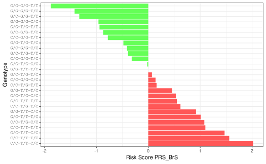

# Risk of Brugada syndrome patients

## Introduction

In this example we walk you through an hypothetical usage case of a
quincunx application with the goal of calculating the risk of developing
a specific disease. For illustrative purposes, the disease chosen here
is the Brugada syndrome¹.

Brugada syndrome is a rare, inherited cardiac disease leading to
ventricular fibrillation and sudden cardiac death in structurally normal
hearts. People with Brugada syndrome have an increased risk of having
irregular heart rhythms beginning in the lower chambers of the heart
(ventricles)².

The prevalence varies among regions and ethnicities, affecting mostly
males. The risk stratification and management of patients, predominantly
asymptomatic, still remains challenging. Currently, despite several
genes identified, SCN5A has attracted the most attention, and in
approximately 30% of patients, a genetic variant may be implicated as
causal factor after a comprehensive analysis³.

In the walk-through below, we show how to use quincunx to search for
Brugada syndrome related polygenic scores, and how to compute the
associated risk depending on the risk alleles of the associated genetic
variants.

## Searching for Brugada syndrome in the PGS Catalog

Before anything, let us load quincunx:

``` r

library(quincunx)
```

Now, we start by searching for the Brugada syndrome in the PGS Catalog.
To do this we search for any traits/diseases that might include the term
`"brugada"` in the trait description using the function
[`get_traits()`](https://ascentsoftware.github.io/quincunx/reference/get_traits.md):

``` r

# Search in PGS Catalog for traits/diseases containing the term "brugada"
brs_traits <- get_traits(trait_term = 'brugada', exact_term = FALSE)
```

We can see that indeed there is one trait specifically associated with
the Brugada syndrome, and that it has the EFO trait MONDO_0015263, whose
description confirms it to be a *genetic disease ventricular arrhythmia
that may result in sudden death*. In addition, from the table `pgs_ids`
we can retrieve the associated PGS score identifiers:

``` r

# EFO Id
brs_traits@traits$efo_id
#> [1] "MONDO_0015263"

# Brugada syndrome description as defined by the Experimental Factor Ontology
brs_traits@traits$description
#> [1] "A genetically heterogeneous condition characterized by complete or incomplete right bundle branch block accompanied by ST elevation in leads V1-V3. There is a high incidence of ventricular arrhythmia that may result in sudden death. [NCIT: C142891]"

# PGS scores associated with Brugada syndrome
brs_traits@pgs_ids$pgs_id
#> [1] "PGS000737" "PGS001779"
```

## Getting details about the polygenic score PGS000737

From the main table, `scores`, in `brs_pgs` object, we can see the
following details:

- The name given to the polygenic score PGS000737 is *PRS_BrS*
- *PRS_BrS* definition is in the PGS Catalog the same as the one in the
  original publication, because `matches_publication` is `TRUE`
- The original authors’ reported trait was *Brugada syndrome*
- And finally, the number of variants comprising *PRS_BrS* is three.

``` r

brs_pgs <- get_scores(pgs_id = 'PGS000737')

# PGS code name
brs_pgs@scores$pgs_name
#> [1] "PRS_BrS"

# Does the PGS score matches the one in the source publication?
brs_pgs@scores$matches_publication
#> [1] TRUE

# Authors' own description of the trait
brs_pgs@scores$reported_trait
#> [1] "Brugada syndrome"

# Number of variants included in the polygenic risk score
brs_pgs@scores$n_variants
#> [1] 3
```

## Original publication that developed PGS000737

From the table `publications`, in `brs_pgs` object, we can see, *inter
alia*, the following details about the publication behind the PGS
PGS000737:

- The Catalog identifier assigned to this publication is PGP000144
- The publication PubMed id is 31504448
- It has been published in 2019-10-01
- The publication title is: *Predicting cardiac electrical response to
  sodium-channel blockade and Brugada syndrome using polygenic risk
  scores.*

``` r

# PGP id
brs_pgs@publications$pgp_id
#> [1] "PGP000144"

# PubMed id
brs_pgs@publications$pubmed_id
#> [1] 31504448

# Publication date
brs_pgs@publications$publication_date
#> [1] "2019-10-01"

# Journal
brs_pgs@publications$publication
#> [1] "Eur Heart J"

# Title
brs_pgs@publications$title
#> [1] "Predicting cardiac electrical response to sodium-channel blockade and Brugada syndrome using polygenic risk scores."
```

To view this publication online:
`open_in_pubmed(brs_pgs@publications$pubmed_id)`.

## Sample ancestry

To get a feeling for the applicability of this polygenic score, it is
important to know the genetic diversity of the participants involved in
the development of the risk score. We can get details on the ancestry
composition of the samples used to develop PRS_BrS by looking into the
`samples` table. In this table we can see that one sample
(`sample_id = 1`) of `r brs_pgs@samples$sample_size` individuals was
used at the `r brs_pgs@samples$stage` stage. The ancestry category
associated with these individuals is European. You can use quincunx’s
internal dataset on possible ancestry categories: `ancestry_categories`.

From this data, one may assume that the applicability of this risk score
should probably be restricted to people from European ancestry.

``` r

# Stage
brs_pgs@samples$stage
#> [1] "gwas"

# Sample size
brs_pgs@samples$sample_size
#> [1] 1427

# Ancestry
brs_pgs@samples$ancestry_category
#> [1] "European"

# Definition of European ancestry
ancestry_categories[ancestry_categories$ancestry_category == 'European', 'definition', drop = TRUE]
#> [1] "Includes individuals who either self-report or have been described by authors as European, Caucasian, white, or one of the sub-populations from this region (e.g., Dutch). This category also includes individuals who genetically cluster with reference populations from this region, for example, 1000 Genomes and/or HapMap CEU, FIN, GBR, IBS, and TSI populations"

# Cohort
brs_pgs@cohorts
#> # A tibble: 1 × 4
#>   pgs_id    sample_id cohort_symbol cohort_name                                 
#>   <chr>         <int> <chr>         <chr>                                       
#> 1 PGS000737         1 DESIR         Epidemiological Study on the Insulin Resist…
```

## The genetic composition of PRS_BrS

To get the polygenic risk score *PRS_BrS* (i.e., PGS000737), we start by
downloading it using the function `read_scoring_file`:

``` r

PRS_BrS <- read_scoring_file('PGS000737')
PRS_BrS
#> $PGS000737
#> $PGS000737$metadata
#> # A tibble: 1 × 16
#>   format_version pgs_id    pgs_name reported_trait   mapped_trait     efo_trait 
#>   <chr>          <chr>     <chr>    <chr>            <chr>            <chr>     
#> 1 2.0            PGS000737 PRS_BrS  Brugada syndrome Brugada syndrome MONDO_001…
#> # ℹ 10 more variables: genome_build <chr>, weight_type <chr>,
#> #   number_of_variants <int>, pgp_id <chr>, citation <chr>, license <chr>,
#> #   HmPOS_build <chr>, HmPOS_date <date>, HmPOS_match_chr <chr>,
#> #   HmPOS_match_pos <chr>
#> 
#> $PGS000737$data
#> # A tibble: 3 × 7
#>   rsID       chr_name chr_position effect_allele other_allele effect_weight
#>   <chr>      <chr>           <int> <chr>         <chr>                <dbl>
#> 1 rs11708996 3            38633923 C             G                     0.55
#> 2 rs10428132 3            38777554 G             T                    -0.94
#> 3 rs9388451  6           126090377 C             T                     0.46
#> # ℹ 1 more variable: locus_name <chr>
```

This PGS is comprised of only three variants: rs11708996, rs10428132,
and rs9388451. These variants are located near loci well-know to be
associated with the Brugada syndrome: SCN5A, SCN10A, NCOA7, and HEY2.
From the `effect_weight` column, we can see that the effect allele
(`"C"` in both cases) of variants rs11708996 and rs9388451 increases the
risk score ($`\beta = 0.55`$ and $`\beta = 0.46`$, respectively),
whereas the `"G"` allele of rs10428132 has a protective effect relative
to the `"T"` allele ($`\beta = -0.94`$).

Now, to illustrate the calculation of *PRS_BrS* using appropriate
patient-level data, we will generate all possible genotypes for these
three variants, and calculate their respective risk scores. (We are not
using real patient data here since such human datasets are not open).
Each biallelic variant has three possible genotypes: A/A, A/a or a/a.
Given that the score is also comprised of three variants, the total
number of possible genotypes is $`3\times3\times3= 27`$.

The function `genotypes` defined below generates the three genotypes for
the given variant alleles:

``` r

genotypes <- function(allele1, allele2) {
  alleles <- c(allele1, allele2)
  m <- tidyr::expand_grid(allele1 = alleles, allele2 = alleles)[-3,]
  paste(m[, 1, drop = TRUE], m[, 2, drop = TRUE], sep = '/')
}
```

For example, rs11708996 genotypes are:

``` r

genotypes('G', 'C')
#> [1] "G/G" "G/C" "C/C"
```

The set of all 27 genotypes can be generated as follows:

``` r

BrS_genotypes <- tidyr::expand_grid(
  rs11708996 = genotypes('G', 'C'),
  rs10428132 = genotypes('T', 'G'),
  rs9388451 = genotypes('T', 'C')
) |>
  tibble::rowid_to_column('patient')

print(BrS_genotypes, n = Inf)
#> # A tibble: 27 × 4
#>    patient rs11708996 rs10428132 rs9388451
#>      <int> <chr>      <chr>      <chr>    
#>  1       1 G/G        T/T        T/T      
#>  2       2 G/G        T/T        T/C      
#>  3       3 G/G        T/T        C/C      
#>  4       4 G/G        T/G        T/T      
#>  5       5 G/G        T/G        T/C      
#>  6       6 G/G        T/G        C/C      
#>  7       7 G/G        G/G        T/T      
#>  8       8 G/G        G/G        T/C      
#>  9       9 G/G        G/G        C/C      
#> 10      10 G/C        T/T        T/T      
#> 11      11 G/C        T/T        T/C      
#> 12      12 G/C        T/T        C/C      
#> 13      13 G/C        T/G        T/T      
#> 14      14 G/C        T/G        T/C      
#> 15      15 G/C        T/G        C/C      
#> 16      16 G/C        G/G        T/T      
#> 17      17 G/C        G/G        T/C      
#> 18      18 G/C        G/G        C/C      
#> 19      19 C/C        T/T        T/T      
#> 20      20 C/C        T/T        T/C      
#> 21      21 C/C        T/T        C/C      
#> 22      22 C/C        T/G        T/T      
#> 23      23 C/C        T/G        T/C      
#> 24      24 C/C        T/G        C/C      
#> 25      25 C/C        G/G        T/T      
#> 26      26 C/C        G/G        T/C      
#> 27      27 C/C        G/G        C/C
```

In `BrS_genotypes` we have now a table of all possible genotypes
comprising the three variants of *PRS_BrS*. We have prepended a column
with a dummy patient identifier (`patient`) to refer to each one of the
27 possible genotypes in an unambiguous way.

## PRS_BrS calculation

If we assume an additive genetic architecture, with independence of risk
variants, then the calculation of PRS_BrS is straightforward: simply
multiply the number of effect alleles in the genotype by the
`effect_weight`, and add up everything:

``` math
{PRS_{BrS}} = \beta_{\text{rs11708996}} \times x_{rs11708996} + \beta_{\text{rs10428132}} \times x_{rs10428132} + \beta_{\text{rs9388451}} \times x_{rs9388451}
```
where, e.g., $`\beta_{\text{rs11708996}} = 0.55`$, and
$`x_{rs11708996}`$ is either $`0`$, for genotype “G/G”, $`1`$, for
genotype “G/C” or $`2`$, for genotype “C/C”.

As a side note, although simplistic, the additive model reflects our
best estimate of genetic architecture of common complex disorders, where
little evidence of interaction between genetic variants is detected. And
although this type of model ignores any gene-gene or gene-environment
interactions⁴, it seems, nevertheless, that the largest meta-analysis of
heritability from twin studies supports a simple additive model in most
of the traits examined⁵.

Next we calculate PRS_BrS for the genotypes `BrS_genotypes`:

``` r

prs <- Vectorize(function(scoring, variant_id, genotype) {
  alleles <- unlist(strsplit(genotype, '/'))
  eff <-
    scoring[scoring$rsID == variant_id, 'effect_allele', drop = TRUE]
  weight <-
    scoring[scoring$rsID == variant_id, 'effect_weight', drop = TRUE]
  
  (alleles[1] == eff) * weight + (alleles[2] == eff) * weight
}, vectorize.args = 'genotype')
```

And, *voilà*, here are the risk scores for all possible genotypes:

``` r

s <- PRS_BrS$PGS000737$data
scores <- BrS_genotypes |>
  dplyr::mutate(
    score = prs(s, 'rs11708996', rs11708996) +
      prs(s, 'rs10428132', rs10428132) +
      prs(s, 'rs9388451', rs9388451)
  )

print(scores, n = Inf)
#> # A tibble: 27 × 5
#>    patient rs11708996 rs10428132 rs9388451   score
#>      <int> <chr>      <chr>      <chr>       <dbl>
#>  1       1 G/G        T/T        T/T        0     
#>  2       2 G/G        T/T        T/C        0.46  
#>  3       3 G/G        T/T        C/C        0.92  
#>  4       4 G/G        T/G        T/T       -0.94  
#>  5       5 G/G        T/G        T/C       -0.48  
#>  6       6 G/G        T/G        C/C       -0.0200
#>  7       7 G/G        G/G        T/T       -1.88  
#>  8       8 G/G        G/G        T/C       -1.42  
#>  9       9 G/G        G/G        C/C       -0.96  
#> 10      10 G/C        T/T        T/T        0.55  
#> 11      11 G/C        T/T        T/C        1.01  
#> 12      12 G/C        T/T        C/C        1.47  
#> 13      13 G/C        T/G        T/T       -0.39  
#> 14      14 G/C        T/G        T/C        0.0700
#> 15      15 G/C        T/G        C/C        0.53  
#> 16      16 G/C        G/G        T/T       -1.33  
#> 17      17 G/C        G/G        T/C       -0.87  
#> 18      18 G/C        G/G        C/C       -0.410 
#> 19      19 C/C        T/T        T/T        1.1   
#> 20      20 C/C        T/T        T/C        1.56  
#> 21      21 C/C        T/T        C/C        2.02  
#> 22      22 C/C        T/G        T/T        0.160 
#> 23      23 C/C        T/G        T/C        0.62  
#> 24      24 C/C        T/G        C/C        1.08  
#> 25      25 C/C        G/G        T/T       -0.78  
#> 26      26 C/C        G/G        T/C       -0.320 
#> 27      27 C/C        G/G        C/C        0.140
```

And below a graphical visualisation of the risk scores from lowest (top)
to highest (bottom):



The polygenic risk score spans a range from (almost) $`-2`$ to (litle
more than) $`2`$. Those genotypes with a negative score carry mostly
“protective” alleles, e.g., the most extreme case being `G/G-G/G-T/T`
(containing only “protective” alleles)—individuals carrying this
genotype have the lowest risk of developing the Brugada syndrome; on the
other hand, individuals carrying the genotype `C/C-T/T-C/C` have the
highest risk, and should probably be subject to closer clinical
follow-up.

## Final remarks

The question of how to use the risk scores obtained, namely, how to
proceed clinically, is an open and on-going discussion in the medical
community that typically needs to be considered in the larger context of
each individual characteristics. A good place to start looking into this
discussion is the original paper which published this polygenic risk
score⁶.

Furthermore, the purpose of this vignette is to show how to start from a
trait or disease of interest, and end up by actually calculating the
risk scores for particular individuals (if the user has real patient
data). In this example, the individuals are hypothetical, and are
represented by their in silico constructed genotypes. While trying to
apply the same workflow to other traits or diseases, things are likely
to be different from this simple example, namely, the number of variants
will likely be much larger, and the polygenic risk score model applied
could be more complex than the simple additive architecture assumed
here. Also, you will probably want to take advantage of a dedicated tool
that specialises in score computation instead of using your own custom R
code, e.g., you could use the popular
[bigsnpr](https://privefl.github.io/bigsnpr/articles/LDpred2.html)
package⁷.

## References

1\.

Brugada, J. [Featuring: Josep
Brugada](https://doi.org/10.15420/ecr.2019.14.3.cm1). *European
Cardiology Review* **14**, 197–200 (2019).

2\.

Sarquella-Brugada, G., Campuzano, O., Arbelo, E., Brugada, J. & Brugada,
R. [Brugada syndrome: Clinical and genetic
findings](https://doi.org/10.1038/gim.2015.35). *Genetics in Medicine*
**18**, 3–12 (2015).

3\.

Brugada, J., Campuzano, O., Arbelo, E., Sarquella-Brugada, G. & Brugada,
R. [Present Status of Brugada
Syndrome](https://doi.org/10.1016/j.jacc.2018.06.037). *Journal of the
American College of Cardiology* **72**, 1046–1059 (2018).

4\.

Aschard, H. [A perspective on interaction effects in genetic association
studies](https://doi.org/10.1002/gepi.21989). *Genetic Epidemiology*
**40**, 678–688 (2016).

5\.

Polderman, T. J. C. *et al.* [Meta-analysis of the heritability of human
traits based on fifty years of twin
studies](https://doi.org/10.1038/ng.3285). *Nature Genetics* **47**,
702–709 (2015).

6\.

Tadros, R. *et al.* [Predicting cardiac electrical response to
sodium-channel blockade and Brugada syndrome using polygenic risk
scores](https://doi.org/10.1093/eurheartj/ehz435). *European Heart
Journal* **40**, 3097–3107 (2019).

7\.

Privé, F., Aschard, H., Ziyatdinov, A. & Blum, M. G. B. Efficient
analysis of large-scale genome-wide data with two R packages: Bigstatsr
and bigsnpr. *Bioinformatics* (2018)
doi:[10.1093/bioinformatics/bty185](https://doi.org/10.1093/bioinformatics/bty185).
